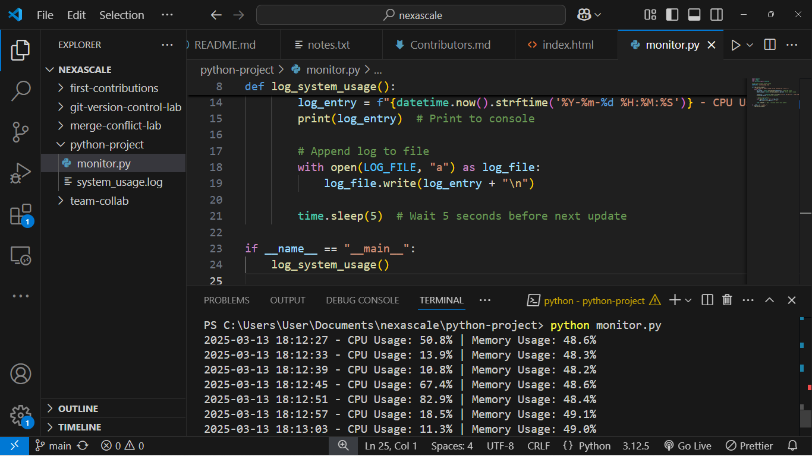
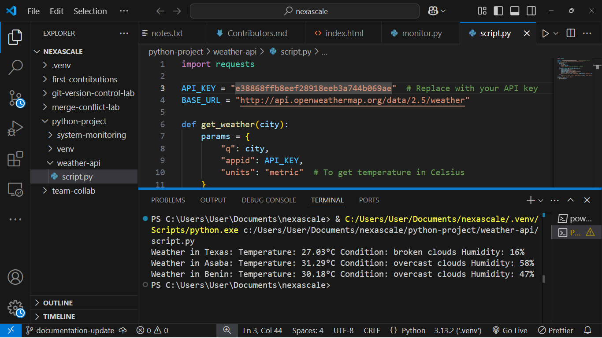
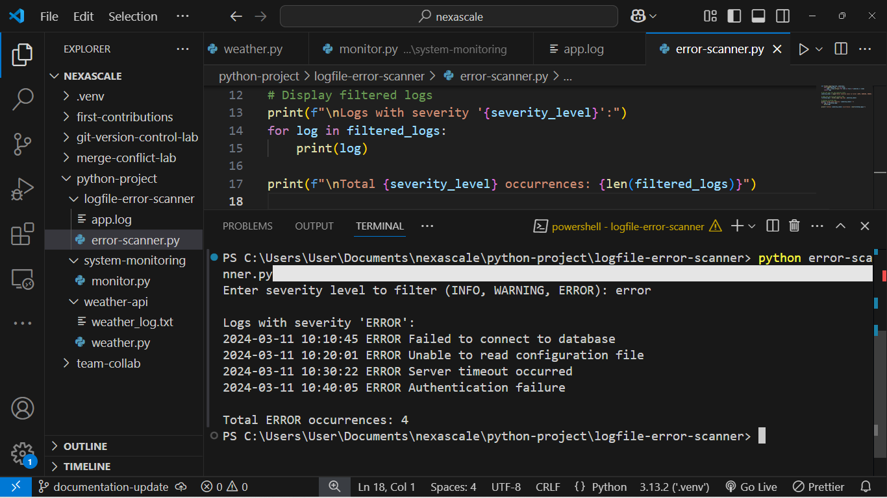

# **Python Hands-On Projects**  

This repository contains three Python projects covering system monitoring, API interaction, and log file scanning. Each project demonstrates practical applications of Python, including real-time monitoring, API integration, and log file analysis.  

---

## **📂 Project Structure**  

```
python-project/
├── logfile-error-scanner/
│   ├── app.log
│   ├── error-scanner.py
│
├── screenshots/
│   ├── system-monitoring.png
│   ├── weather-api.png
│   ├── logfile-error-scanner.png
│
├── system-monitoring/
│   ├── monitor.py
│   ├── system_usage.log
│
├── weather-api/
│   ├── .env
│   ├── weather_log.txt
│   ├── weather.py
│
└── README.md
```

---

## **1️⃣ System Monitoring**  

A Python script that monitors CPU and memory usage at intervals and logs the data for analysis.  

### **How to Run:**  
1. Navigate to the project directory:  
   ```bash
   cd system-monitoring
   ```
2. Run the script:  
   ```bash
   python monitor.py
   ```
3. The script prints real-time CPU and memory usage and logs data to `system_usage.log`.  

📌 **Bonus:** Saves CPU and memory usage data for future analysis.  

📸 **Screenshot:**  
  

---

## **2️⃣ Weather API Fetcher**  

Fetches live weather details for multiple cities using OpenWeatherMap API.  

### **How to Run:**  
1. Get an API key from [OpenWeatherMap](https://openweathermap.org/).  
2. Create a `.env` file and store your API key:  
   ```
   API_KEY=your_api_key
   ```
3. Run the script:  
   ```bash
   cd weather-api
   python weather.py
   ```
4. Enter city names (comma-separated) when prompted.  

📌 **Bonus:** Fetches data for multiple cities and logs results to `weather_log.txt`.  

📸 **Screenshot:**  
  

---

## **3️⃣ Log File Error Scanner**  

Scans a `.log` file (`app.log`) and counts occurrences of "ERROR".  

### **🚀 How to Run:**  
1. Navigate to the project directory:  
   ```bash
   cd logfile-error-scanner
   ```
2. Run the script:  
   ```bash
   python error-scanner.py
   ```
3. The script counts occurrences of the word "ERROR" and prints the total.  

📌 **Bonus:** Can be extended to filter logs by date or severity level (INFO, WARNING, ERROR).  

📸 **Screenshot:**  
  

---

## **🚀 How to Contribute**  

1. Fork the repository  
2. Create a new branch: `git checkout -b feature-branch`  
3. Make your changes and commit: `git commit -m "Added new feature"`  
4. Push the changes: `git push origin feature-branch`  
5. Open a Pull Request  

---

## **🔗 License**  

This project is open-source and available under the MIT License.  